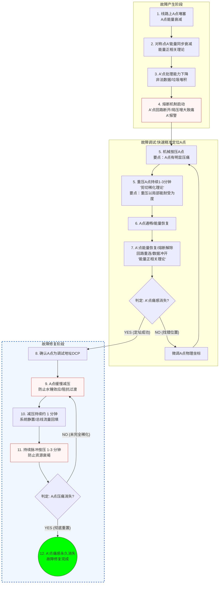

故障产生阶段：（本阶段的关键点是理解系统的熔断机制和对称映射能量衰减理论）

1. 线路上A点堵塞
2. 线路上A点的对称点A'的能量值下降（对称映射能量衰减理论）
3. A'点的处理能力下降，致非法数据堆积在A'点
4. 熔断机制启动，A'点的回路断开，以阻止非法数据在线路中漫延，同时非法数据的堆积使A'点的局部压强过大而产生痛感（这解释了为什么在A'点施治不能治愈的原因，因为回路断开能量不通）

故障调试阶段：（本阶段的关键点是调试点快速寻址）

5. 机械按压A点，压强需要足够大，以局部能耐受为度，令A点的堵塞物剪切稀化（粘性流体的剪切应力理论）
6. A点的通畅，令A点的能量值恢复，根据对称映射能量衰减理论，于是A'点的能量值也恢复。是不是应该把对称映射能量衰减理论扩展为对称映射能量正相关理论？
7. A'点的熔断锁定解除，回路重新连接，回路中的能量流瞬时冲开A'的数据堆积，压强减轻，痛感消失
以上调试过程，通常需要1-3分钟。按着A点，A'点的痛感消失，说明A点就是A'的堵塞点（调试点）。反过来，如果按着A点，A'点的痛感没消失，说明A点找错了，需要微调找准A的位置。

故障修复阶段：（本阶段的关键点是宏观脉冲与阻抗缓冲协议）

8. A'点的痛感消失后，如果持续按压A点，会造成A点的资源衰竭，形成无效做功。（这解释了为什么需要脉冲式按压）
9. A'点的痛感消失后，应缓慢解除A点的按压（进行受控的阻抗过渡，防止“水锤效应”与系统震荡）
10. 松开之后，过几分钟，A'点的痛感会再出现。这是因为A点的堵塞物的剪切稀化并未形成永久性效果，它们会很快再度回复形成堵塞，于是回到步骤1。
11. 松开 1 分钟左右，再度按压A点。松开1分钟左右，是为了给系统留出空间，让周边的主干总线流量重新回填到调试点这个“泵房”里
12. 持续按压A点1-3分钟，再缓慢减压1分钟。重复以上步骤，直到A点的压痛感消失，则A'点的痛感消失且不再反复出现。

