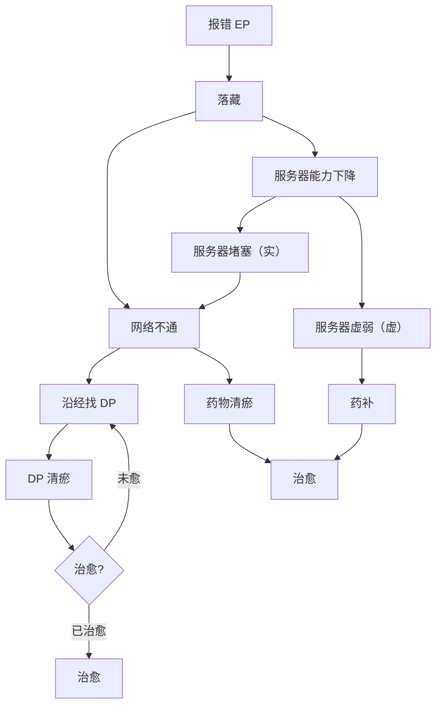

上篇 日常运维

系统自检报告

定期日常维护

下篇 系统设计（及故障解除）

一、系统总体设计

阴阳五行（五脏的阴阳设计、五脏与五行的对应、五行生克关系、五行正治法、五行急治法）

二、网络结构设计

主干线设计（前中后）

六阳经六阴经

奇经八脉

三、系统功能设计

落藏

四、故障解除逻辑

故障解除流程图

DP 特征（压痛、色块、色点、小丘疹、结节、硬块）

DP 寻址逻辑
- 上病下治、下病上治、左病右治、右病左治、前病后治、后病前治、四肢病中间治、中间病四肢治
- 最近的Gateway、沉邪点、八脉交会穴、八会穴、俞合穴、募穴、原穴、郄穴、络穴、对称点）

DP 处理目标（把结节硬块揉散化开）和处理方法（揉、捏、重按轻提）

EP 非法数据清除（排气、拔脓）

