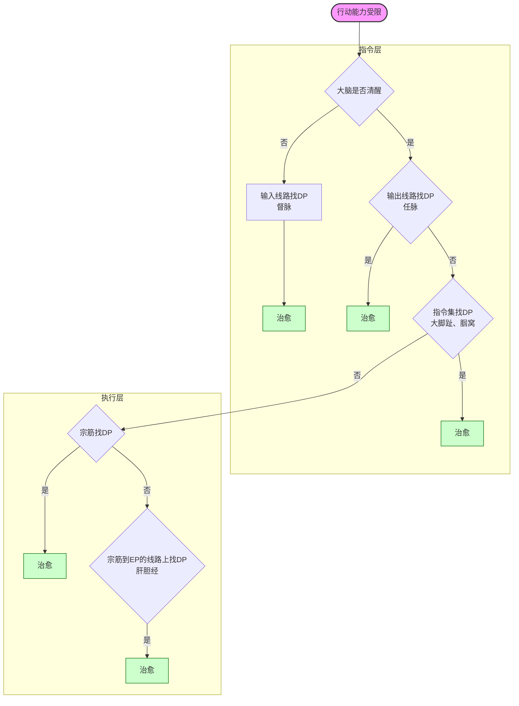

上篇 日常运维

系统自检报告

定期日常维护

下篇 系统设计（及故障解除）

一、系统总体设计

人体系统架构设计说明。
- 基础理论层。阴阳为人体系统实现和运行的基本原理，不止人体系统，整个世界都是基于阴阳思想实现和运行的。阳负责提升增加，阴负责减少降低，阴阳合力，才能使事物维持动态平衡。在温度上，阳负责升温，阴负责降温；在速度上，阳负责增速，阴负责减速；
- 基础层。落实到生命系统，阴阳具体实现为气血。气是阳的实现，血是阴的实现。在基础层，阴阳就不再是概念，而是具体的物质：气和血；
- 服务层。
  - ** 人体系统由五个子系统组成：肝心脾肺肾。五个子系统仍然遵循阴阳的设计规范，肝系统的阴由肝实现，阳由胆实现；心系统的阴由心实现，阳由小肠实现；脾系统的阴由脾实现，阳由胃实现；肺系统的阴由肺实现，阳由大肠实现；肾系统的阴由肾实现，阳由膀胱实现。
  - ** 在五行中，肝代表木。肝主风。在四季，肝对应春。在方位，肝对应东。在味道，酸入肝。在气味，肝味臊。在情绪，肝主怒。在声音，肝音嘘；其畜鸡，其谷麦，其果李。肝主筋。肝主语。肝开窍于目。肝其华在爪甲。在变动为握。肝病发惊骇。怒伤肝，悲胜怒。风伤筋，燥胜风。酸伤筋，辛胜酸。肝上有邪沉于两腋。肝藏血，血舍魂，魂聚则为神。肝气虚则恐，实则怒。诸风掉眩皆属于肝。久行伤筋劳于肝。女子以肝为本。
  - ** 在五行中，心代表火。心主热。在四季，心对应夏。在方位，心对应南。在味道，苦入心。在气味，心味焦。在情绪，心主喜。在声音，心音嚯；其畜羊，其谷黍，其果杏。心主血脉。心开窍于耳目舌。心其华在面。在变动为忧。心病及五脏。喜伤心，恐胜喜。热伤气，寒胜热。苦伤气，咸胜苦。心肺有邪沉于两肘。心主神志。心主汗。心藏脉，脉舍神。心气虚则悲，实则笑不休。诸痛痒疮皆源于心。
  - ** 在五行中，脾代表土。脾主湿。在四季，脾对应长夏。在方位，脾对应中。在味道，甘入脾。在气味，脾味香。在情绪，脾主思。在声音，脾音呼；其畜牛，其谷稷，其果枣。脾主肉。脾主四肢。脾开窍于口。脾其华在唇。在变动为哕。脾病发肌肉。思伤脾，怒胜思。湿伤肉，风胜湿。甘伤肉，酸胜甘。脾上有邪沉于两胯。脾藏营，营舍意。脾气虚则四肢不用五脏不安，实则腹胀经溲不利。诸痉项强皆属于湿，诸湿肿满皆属于脾。久坐伤肉劳于脾。
  - ** 在五行中，肺代表金。肺主燥。在四季，肺对应秋。在方位，肺对应西。在味道，辛入肺。在气味，肺味腥。在情绪，肺主忧。在声音，肺音呬；其畜马，其谷稻，其果梨。肺主皮毛。肺主治节。肺开窍于鼻。肺其华在毛。肺通调水道。在变动为咳。肺病发背部。忧伤肺，喜胜忧。热伤皮毛，寒胜热。辛伤皮毛，苦胜辛。心肺有邪沉于两肘。肺藏气，血舍魄，魄聚则为精。肺气虚则鼻塞不利少气，实则喘呃胸盈仰吸。诸气愤郁皆属于肺。行寒饮冷伤肺。久卧伤气劳于肺。
  - ** 在五行中，肾代表水。肾主寒。在四季，肾对应冬。在方位，肾对应北。在味道，咸入肾。在气味，肾味腐。在情绪，肾主恐。在声音，肾音吹；其畜猪，其谷豆，其果坚。肾主骨。肾主脑。肾开窍于耳及二阴。肾为胃之关。肾其华在发。在变动为栗。肾病发关节。恐伤肾，思胜恐。寒伤血，燥胜寒。咸伤血，甘胜咸。肾上有邪沉于两腘。肾藏精，精舍志。肾气虚则厥，实则胀五脏不安。诸寒收引皆属于肾。心如悬若饥状，是肾的病候。强力举重久坐湿地伤肾。房事伤肾。
  - ** 五个子系统遵循相生关系。即木生火，火生土，土生金，金生水，水生木。相生关系，确定了母子关系。如木生火，则木为火之母，火为木之子。相生关系应用于系统维护中，即为：虚则补其母，实则泄其子；子又能令母实，母又能令子虚。
  - ** 五个子系统遵循相克关系。即木克土，土克水，水克火，火克金，金克木。相克关系应用于系统检修中，见效很快。
- 网络层。五个子系统分别有自己的网络。由于五个子系统分别有阴有阳，所以各自有阴阳两个网络，都包含主干线和毛细网络，连接服务器和身体各部份。五个子系统共计十个子网络。另外，心系统因为其特殊职能和地位，另为其设计了外围的防火墙系统——心包系统，心包系统也包含阴阳，心包为阴，三焦为阳。合计十二个子网络，其主干线称为十二正经，具体为：肝经、胆经、心经、小肠经、脾经、胃经、肺经、大肠经、肾经、膀胱经、心包经、三焦经；
- 协作层。十二个子网络都遍布身体系统，在终端相互盘绕协作。
- 应用层。人体的消化吸收、运动、表情、思维、情绪、说话等功能表现。

二、网络结构设计

包括十二正经和奇经八脉，参见《针灸大成》。

三、系统运行设计

人体系统时刻处在动态平衡的维持中。打破平衡的最常见因素是寒，因为人体温度通常高于环境温度。对于寒的入侵，人体的处理办法通常是加热，所以反过来，一旦人体某个脏器热了，说明那里有寒入侵了。脏器发热，有它的外在表现：

肝上有热左颊（颧骨一带）赤，肺上有热右颊赤，心上有热额（指前额眉间这一带）先赤，脾上有热鼻先赤，肾上有热两颐赤。两颐指耳门听宫听会颊车这一带。

四、故障解除逻辑
五行正治法、五行急治法）
在说明故障解除逻辑之前，需要先申明几个概念。
- EP （Error Point）报错点。 EP 指在没有任何外力作用的情况下，自主产生的报错，包括痛、痒、麻、热、肿胀等等。
- DP （Debug Point）调试点。 狭义的 DP 指对于压力有反应的点，最常见的反应是压痛或酸胀。广义的 DP 除了压痛，还包括没有不适反应但有外形变化的点，比如色块、色点、小丘疹、结节、硬块、明显的瘀络、鼓包等。把 DP 的异常清掉（比如揉到不痛），就能令 EP 的报错自然解除。
- 三个网关（Gateway）
  - ** 顶网关（Top Gateway）。指颅骨下沿线及颌骨下沿线，以及整个颈项。
  - ** 上网关（Upper Gateway）。指肩关节，包括锁骨、肩胛骨，以及臂锁、臂肩关节缝。
  - ** 下网关（Lower Gateway）。指髂骨上沿线及耻骨上沿线，以及它们所包围覆盖的整个下腹部。

DP 寻址逻辑

- 如果 EP 是一个点，说明问题出在网络层，则在离 EP 最近的 Gateway 上沿线找 DP。比如手腕小指侧关节痛，则在同侧肩胛骨及臂肩关节缝上找压痛点，找到后把它揉到不痛，手腕关节就不痛了。
- 如果 EP 是一个片，说明问题出在协作层，就需要在服务层去找错误源，把错误落实到具体的子系统。落实了问题子系统后，就可以在相应的位置去找 DP ，如沉邪点、八脉交会穴、八会穴、俞合穴、募穴、原穴、郄穴、络穴。
- 重病都加拔肛门
- 肺。肺气实：肺与膀胱别通、气会膻中；肺气虚：肛门；肺寒：大肠募天枢、大肠俞；水道：肺募云门；综合：肺俞、肺原太渊
- 脾。四肢肌肉问题：肚脐；其它问题：脾俞；湿：髀（胯骨沿儿或腹股沟）；热：历兑、隐白；
- 心。热：肘窝；寒：脖子、宗筋；堵：龙胆泻肝丸
- 肝。
- 肾。

DP 处理目标（把结节硬块揉散化开）和处理方法（揉、捏、重按轻提）

EP 非法数据清除（排气、拔脓）

   

行动能力受限的故障处理逻辑

行动能力受限的疾病：脑瘤、脑瘀血、脑血栓、脑卒中（脑溢血、脑梗死）、帕金森综合症、老年痴呆、植物人、瘫痪、半身不遂、癫痫

