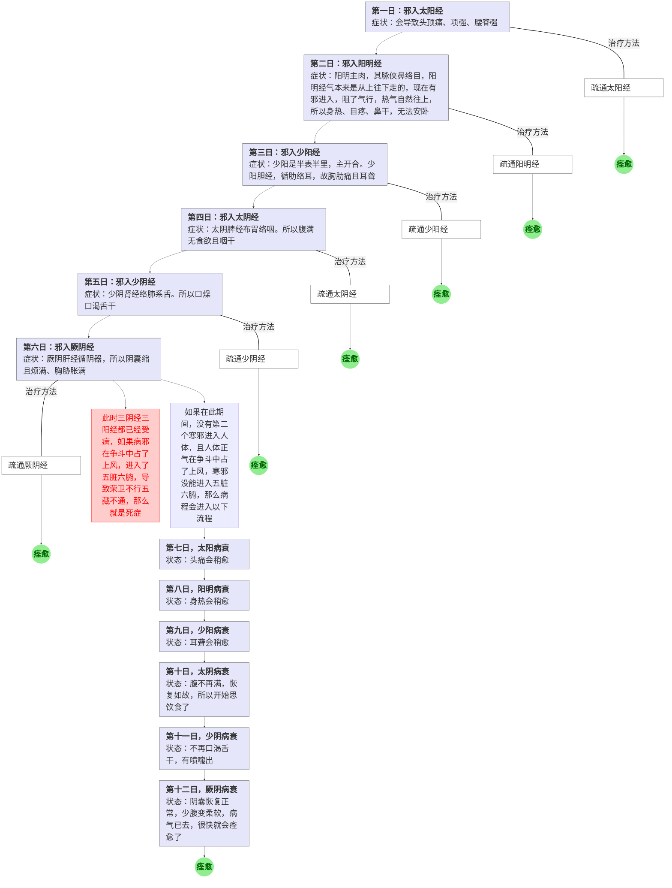
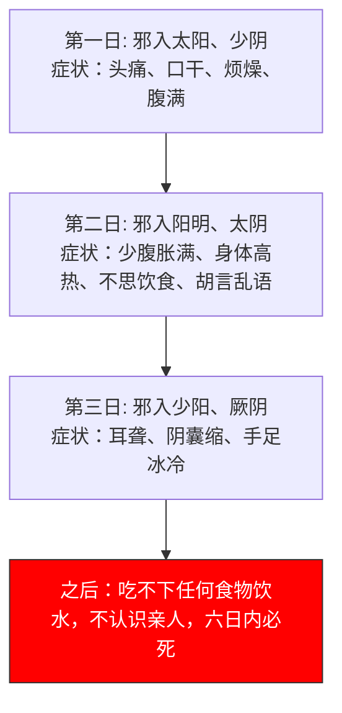

# 第四部份 常见问题集合
31、热论
32、刺热篇
33、评热病论
34、逆调论
35、疟论
36、刺疟篇
37、气厥论
38、咳论
39、举痛论
40、腹中论
41、刺腰痛篇
42、风论
43、痺论
44、痿论
45、厥论
46、病能论
47、奇病论
48、大奇论
55、长刺节论
60、骨空论
63、缪刺论

## 热（出自 31、热论）

热病的原因，都是伤于寒。即使发高烧，也不会致死。但若两个寒邪同时进入阴经和阳经，必不免于死。

引起热病的寒邪，在人体中会随着经络一路前进，它走到哪里，哪里就有相应的症状出现。下表是寒邪的行走路径和进程，以及我们的治疗方法：

|时间|病邪位置|症状|治疗方法|
|---|---|---|---|
|第一日|进入太阳经|会导致头顶痛、项强、腰脊强|疏通太阳经。如果寒邪较轻，太阳经一疏通，正气一冲，寒邪就散了，就不会有下一步了。以下每一步皆如此理。|
|第二日|进入阳明经|阳明主肉，其脉侠鼻络目，阳明经气本来是从上往下走的，现在有邪进入，阻了气行，热气自然往上，所以身热、目疼、鼻干；由于胃肠气逆不舒，所以人无法安卧|疏通阳明经|
|第三日|进入少阳经|少阳是半表半里，主开合。少阳胆经，循肋络耳，故胸肋痛且耳聋|疏通少阳经|
|-|---|---|寒在三阳经的治疗办法——汗解 三阳经受了寒邪，可以用汗解法治疗。所谓汗解法，就是发汗，让汗把邪带出体外。 只有一种情况不能用汗解，就是阳明腑热。邪在阳明，会引起腑热和经热两种情况。如果是阳明经热，可用汗解，比如用白虎汤；如果是阳明腑热（即肠胃热），则病人大便排不出来，排不出来的原因是肠道精液被热烧干了，如果此时还用汗解，进一步损伤经液，则便秘的状况会更加严重。所以阳明腑热的情况下，是用攻下法治疗，也就是排便，让寒邪通过大便排出去。|
|第四日|进入太阴经|太阴脾经布胃络咽。所以腹满无食欲且咽干|疏通太阴经|
|第五日|进入少阴经|少阴肾经络肺系舌根。所以口燥舌干而渴|疏通少阴经|
|第六日|进入厥阴经|厥阴肝经循阴器，所以阴囊缩且烦满、胸胁胀满|疏通厥阴经|

以上病程在没有任何治疗的情况下，接下来会有两种分支状况：

1、此时三阴经三阳经都已经受病，如果病邪在争斗中占了上风，进入了五脏六腑，导致荣卫不行五藏不通，那么就是死症；

2、如果在此期间，没有第二个寒邪进入人体，且人体正气在争斗中占了上风，寒邪没能进入五脏六腑，那么：

|时间|病程|状态|
|---|---|---|
|第七日|太阳病衰|头痛会稍愈| 
|第八日|阳明病衰|身热会稍愈|
|第九日|少阳病衰|耳聋会稍愈|
|第十日|太阴病衰|腹不再满，恢复如故，所以开始思饮食了|
|第十一日|少阴病衰|不再口渴舌干，有喷嚏出|
|第十二日|厥阴病衰|阴囊恢复正常，少腹变柔软，病气已去，很快就会痊愈了|

以上所描述的病程及愈程，用流程图表示则如下：

::: tip 治疗热症的方法
治疗热症的方法，是使其脏腑经脉通畅无阻，病必日渐衰微。

另外，未满三日的人（病在三阳经），可汗解；如满三日的人，这时病已入阴经及肠腑，可用泄法（即通利法），令排便而愈。
:::

::: info 热病已愈，过几天又复发了，这是怎么回事？
这是因为在热盛（发烧）时勉强进食造成的。虽仍发热，但病邪已衰，此时强进食，导致热与饮食之热相合，造成新的发热。所以感冒发热时没有胃口，就不要勉强吃食，可以不吃，也可以稍进稀粥。

对这种复发的热病，可以看病的虚实情况，虚则补之，实则泄之，必能愈。
:::

::: danger 热病的禁忌
热病在稍愈时，忌吃肉和多食。食肉就会复发，多食会导致遗热，过几天又会发热。
:::

### 两感于寒

两感于寒，就是两个寒邪先后进入阴阳两经，其历程如下：

1、第一日，寒邪进入太阳与少阴，症状：头痛、口干、烦燥、腹满；头痛是太阳症，口干是少阴症

2、第二日，寒邪进入阳明与太阴，症状：少腹胀满、身体高热、不思饮食、胡言乱语；腹满不思饮食是太阴症，身热是阳明症

3、第三日，寒邪进入少阳与厥阴，症状：耳聋、阴囊缩、手足冰冷。耳聋是少阳症，阴囊缩是厥阴症。

4、之后，吃不下任何食物饮水，不认识亲人，六日内必死。

两感于寒的病程，以流程图表示如下：

::: info 热病的分类

凡是伤于寒而发热的，在夏至日前得的，叫温病。这是因为头年的冬天受了寒邪。

凡是伤于寒而发热的，在夏至日后得的，叫暑病。暑病用汗解，用发汗的方法把暑邪排出人体。
:::

## 五脏发热（出自 32、刺热篇）

五脏发热即发炎。

五脏发热，属脏病，因脏有五行属性，故脏病逢克日会加重，逢当值日因脏气旺盛而减轻，如果有厥逆症状，则逢克日会死。如，肝属木，肝病逢庚辛日（金日）会加重；逢甲乙日（木日）会生大汗而热度减轻；如果有手足冰冷、呼吸短气的厥逆症状，逢庚辛日（金日）会死。

|类别|症状|热盛时的症状|治疗方法|
|---|---|---|---|
|肝热（即急性肝炎）|小便先黄，腹中隐痛，容易疲劳，身体发热|热盛时会胡言乱语、易惊、胸胁胀痛、手足躁动不安、无法安卧。如果气逆，会引起阵阵头痛。|刺足厥阴和足少阳|
|心热|先郁闷不乐，过几天才发热。|热盛则卒心痛、无汗、烦闷、易呕、头痛、面红。|刺手少阴心经和手太阳小肠经|
|脾热|先头重，颊痛、烦心、颜青、想吐、身体发热|热盛则腰痛、无法前后弯腰，少腹胀满泄泻，两颔痛|刺足太阴、阳明。常用足三里、三阴交|
|肺热|先打寒颤，感觉寒冷恶风、舌苔黄、身体发热|热盛则喘咳、前胸后背串痛、无法深呼吸、头痛强烈、汗出就觉得冷|刺手太阴、阳明的井穴，出血如大豆，立愈|
|肾热|先腰痛胫酸，口渴多饮（肾主金津玉液，所以肾有热就会口渴），身体发热|热盛则后项强痛、腿胫寒酸、足热、不想说话。严重时后项痛、走路摇晃不定|刺足少阴、太阳|

具体取穴如下：

1、用原穴。

2、荥主身热，用荥穴。

3、末梢瘀络放血。血一出，热就退了。

::: danger 热病的面诊
肝上有热，左颊赤

肺上有热，右颊赤

心上有热，额间赤

脾上有热，鼻先赤

肾上有热，两颐赤

这是五脏发热（发炎）之前的预告。病还没发，但面上这些部位现红色了，说明快要病了。见有红色就赶紧刺相应经脉，则到了该病脏的旺日，病就会痊愈，这就是治未病；如果刺法不当，则要到第三个病脏旺日，病才会好。脏腑旺日，就是脏腑的当值日，比如肝属木，则木日就是肝的旺日，在干支记日中，甲乙属木，所以甲乙日就是肝的旺日。

另外，

赤色从颊向上逆行到颧骨，表示腹中有大硬块，如子宫肌瘤等

赤色从颊向下面颊车扩散，为腹部胀满之症

赤色现于颧后，为胁痛之症

赤色现于颊上，病在膈上
:::

::: info 治热病的统一做法

1、治热病都是发汗降温，可用针刺发汗，也可用药发汗。

2、如果用针刺发汗法，先饮寒水，再刺；穿寒衣，居寒处。体温正常了就停治。

3、发汗降温，必要在其病脏的当令日，令汗大出而热止。比如肝热，就应在甲乙日发汗。
:::

## 五十九热穴——诊断和治疗（出自 61、水热穴论）

人体有五十九热穴，专管身热，其具体是：

头热穴。25穴：督、膀、胆，五线五穴，从上星开始，主要用百会

胸热穴。8穴：缺盆、膺窗、大杼、肺俞

胃热穴。8穴：伏兔、足三里、上巨虚、下巨虚

四肢热穴。8穴：云门、肩髃、环跳、委中

五脏热穴。10穴：肝、心、脾、肺、肾俞。

::: danger 五脏热穴的热移（督脉7穴）
在《61水热穴论》中，提出的五脏热穴为10个，即膀胱经上的肝、心、脾、肺、肾俞，左右各5，共10个。在《32刺热篇》中提到，当发热的时候，因为热气向上，所以五脏热穴会上升，变成：3椎胸（肺）、4椎膈（心）、5椎肝、6椎脾、7椎肾，为5穴。另外还有大椎和尾椎。合共7穴。热病时，这几椎下会有压痛，不仅可确诊是哪个脏器的热病，还可在压痛点及其左右下针治疗。
:::

综合《61水热穴论》和《32刺热篇》的结论，人体共有56个热穴，具体如下表：
|分类|数量|穴位|重点穴|
|---|---|---|---|
|头热穴|25|督、膀、胆，五线五穴，从上星开始|百会|
|胸热穴|8|缺盆、膺窗、大杼、肺俞||
|胃热穴|8|伏兔、足三里、上巨虚、下巨虚||
|四肢热穴|8|云门、肩髃、环跳、委中||
|五脏热穴|7|3椎下胸（肺）、4椎下膈（心）、5椎下肝、6椎下脾、7椎下肾、大椎、长强|大椎|

以上56个穴位，都是能左右热的地方。实际治症中，根据热的不同，在以上各热穴按压，找到压痛点，在压痛点下针，压痛点就是病因堵点。另外，高热时常用百会放血泻头热，用大椎放血泻身热。

## 其它热病（出自 33、评热病论）

|病名|症状|病因|治法|
|---|---|---|---|
|风厥|身体发热，汗出但热不退，且烦燥，胸中满闷|这是太阳受邪而发热，首先影响到肾水，肾水受热成气自然上行，造成脚冷的厥状|刺足太阳膀胱经和足少阴肾经，同时服用汤药|
|劳风|项强而眼向上翻，吐出的粘痰像鼻涕一样，打寒颤，感觉寒冷恶风|这是因为人在过度劳作后正出大汗之际受了风吹|前后弯腰，同时配合呼吸，咳出脓一样的青黄粘痰就好了。精壮者需三天，中年人需五天，老年人需七天。|
|肾风|面肿，以致妨碍说话||不能针刺|
|风水|气短，阵阵发热而热从胸背上至头，汗出，手热，口燥渴，小便黄，眼下肿，腹中肠鸣，身体沉重难以行动，月经不来，烦燥，无法进食，不能仰卧，一仰卧就咳不止|肾风病针刺之后就会变成风水病。正气虚则气短；邪进来了所以会阵阵发热而汗出不止；小便黄是因为腹中有热；无法仰卧是因为胃中有多余的水汽，胃肠有积水时人是无法躺卧的；仰卧则咳是因为水汽向上压迫肺所致；只要腹中有积水，都会先有微肿现于眼下；胃脉积水会导致腿重难行；气上迫肺会影响到心，导致心气不能下行到胞脉，胞脉不通就导致月事不来（胞脉属心，主月事）（二阳有病发心脾，有不得隐曲，女子不月）|刺法中有论|

## 关于寒热（出自 34、逆调论）

|症状|病因|治法|
|---|---|---|
|感觉热而烦燥满闷|阴气少而阳气盛||
|感觉寒冷自体内生出|阳气少阴气多||
|四肢热，如果中风寒，四肢更像火烤一样的热|阴气虚阳气盛||
|身体寒冷，即使用热汤、烤火、厚衣都不能使身体温热，但不打寒颤|多为水中作业者。身寒而不打寒颤，是因为肾阴肾阳都衰弱得连寒颤都打不起了（肾在变动为栗）。此病名为骨痹，病人会有寒冷至骨、关节拘挛的症状||
|肌肉麻木不仁、没有感觉，即便穿了棉衣，仍然麻木不能感到温暖|荣气虚则麻木，卫气虚则没有感觉||
|无法平躺而呼吸有声|阳明气逆。足阳明胃气本应向下行，现在逆向上行，所以无法安卧（胃不和则卧不安），阳明络鼻，所以呼吸有声||
|起居如常而呼吸有声|肺络气逆。络病微，所以起居如常，只是呼吸有声||
|无法平躺，一躺下就喘|水气停在肺中。水应藏在肾中，现在肾病了，不能藏水，水因而上逆入肺，产生一卧即喘的症状。所以卧喘就是肾的问题||

## 疟（出自35、疟论 36、刺疟）

疟疾，是一种时休时发的疾病。开始发作的时候，先是起鸡皮疙瘩，哈欠连连，然后寒冷发抖、牙齿打颤、腰脊疼痛，然后寒冷过去，接着全身内外均发热、头痛欲裂、口渴喜冷饮。

疟疾的发冷，是烤火、泡热水都无法使身体温暖的；疟疾的发热，是敷冰水、饮冷也不能降温的。

疟疾有每日发作一次的，有隔日发作一次的，有逐日提前发作的，有逐日推后发作的。

疟疾发作规律与原因探讨：

|发作规律|原因|
|---|---|
|每日发作一次|疟邪随经络流转，遇上卫气，双方相争就发作，与卫气相离就休止。卫气一日夜绕全身一周，每日卫气行至风府穴时，肌肉腠理会打开，此时邪气趁机进入，一入卫邪就相争，病就发作。|
|隔日或隔数日发作一次|邪躲在很深的位置（如腑上），它走的经脉线就很长，不一定每天能遇上卫气|
|逐日推后发作|邪从风府入侵，与卫气相争，若卫气输，则邪顺着督脉向下一椎推进，所以逐日推后发作|
|逐日提前发作|邪每日向下推进一椎，经过二十五日后，到达尾椎，从二十六日开始，进入脊椎之内，贯注于第九椎，开始上行，所以每日提前发作。九日后进入缺盆内|
|每次发作先冷后热|这是夏天受了暑热，出了大汗，腠理大开，又遇着寒凉水湿之气，于是寒水就藏在腠理皮肤之中，到了秋天，又受了风吹，就成此病了。这是先伤于寒再伤于风。此病名寒疟|
|每次发作先热后冷|冬天受了寒，寒邪深藏于肾中。夏天热盛时，邪与汗同出。邪与卫相争而病。此病名温疟|
|每次发作只热不冷|这是阴津濒临灭绝的现象，只有阳没有阴，病人会呼吸无力、烦躁、手足热、想吐。此病名瘅疟|

### 疟疾的治疗

疟疾发作的时候，不能治疗，只能等病气衰弱时才能针刺。

::: info 治病的时机
病盛时施治必然坏事；病退时施治，才能一举去邪安正。这与两军交战同理，敌军来势汹汹时，此时应战即便胜了也会自伤，应避其锋芒而养精蓄锐，待敌军疲惫松懈时，再行进攻一举拿下，即袪邪又不伤自身正气。

故经言，工不能治其已发，治未发。
:::

::: tip 疟疾的治疗方法（根治法）
治疟很讲究时机。要在疟疾发作前半小时内施治才行，过了时间，就失去时机了，要等到下次发作前。

- 不能确定疟的位置。在疟疾发作之前，大约顿饭时间内下针，也即大约十五到三十分钟的时间内下针，先用绳索紧束四肢末梢。再细细观察，看到有盛坚的瘀络，全部刺络放血。
- 能确定疟的位置。参见后面十二疟表，可以确定疟的位置，同时可按表中的经脉穴位下针。同样在疟发前半小时下针施治。
- 如果有疟疾症状，而脉象又是正常的，说明病刚开始，可刺十指间感觉紧束的位置放血，血出必愈。
- 治疟前先检查病人的身体表面，如果身上有许多像赤小豆一样的红点，全部点刺放血。

按以上方法施治，刺一次病衰，两刺能见好转，三刺必痊愈。不愈则刺舌下两脉出血。再不愈刺委中瘀脉出血。再不愈刺项下的侠脊穴压痛点。必愈。

另外，根据具体病况，下针的先后顺序略有不同：
- 先头痛或头重的，先刺头上百会和攒竹出血；
- 先项背痛的，先刺项背强痛的位置；
- 先腰部脊椎痛的，先刺委中放血；
- 先手臂痛的，先刺手少阴手阳明十指间；
- 先足胫酸痛的，先刺足阳明十指间出血；
- 风疟的，疟发时会汗出且厌恶风吹，可刺三阳经的背部俞穴出血，即胃俞、胆俞、膀胱俞；
- 胫骨酸痛很甚，按之更痛，这叫“胕髓病”，用刀针在绝骨穴放血，血出立愈；
- 身体稍有点小痛的，刺至阴；（凡是刺阴之井穴，都不可出血，且隔日一刺，以不伤元气）
- 不口渴，又隔日一发作的，刺足太阳；
- 口渴，又隔日一发作的，刺足少阳；
- 温疟（先热后寒），又不出汗的，用五十九刺法（即五十九热俞穴）。
:::

::: tip 疟疾的治疗方法（缓解症状）
这是在疟发的时候，为了缓解症状，而行的方法。
- 在身体刚开始热的时候，刺冲阳动脉，摇大针孔，血出则热立退；
- 在身体刚要开始寒的时候，刺手阳明太阴，足阳明太阴；
- 如果脉饱满大急，刺背俞，在一寸半的肝心脾肺肾俞及其三寸穴位上，重按找压痛点，在压痛点放血，这是邪恰好走到这里了；要视病人肥瘦来定放血多少；
- 如果脉小实急，灸胫部足少阴穴位，即太溪、复溜，刺手少阴井穴少冲放血；
- 如果脉缓大虚，说明气血两虚，就不能用针了，要随症用药治疗。
:::

十二疟的症状和刺法：

|疟名|症状|刺法|
|---|---|---|
|疟邪在经脉|||
|疟邪在足太阳膀胱经|腰痛，头重。先寒后热，寒从背起，热像日炙一般。热止后大汗出。很难自愈。|刺委中放血|
|疟邪在足少阳胆经|身体倦怠。寒也不甚，热也不甚，热比较多且汗出不止。怕见人，见人就心生恐惧。|刺临泣|
|疟邪在足阳明胃经|先一阵阵地冷，逐渐寒重，寒久再热。热止后汗出。喜见日月光及火光，一见就高兴。|刺厉兑、内庭、冲阳|
|疟邪在足太阴脾经|郁闷不乐，喜欢叹气，不想吃饭，寒热往来且汗出。发作时容易呕吐，吐后病就衰了，此时即是治疗时机。|大都、太白、公孙瘀络放血|
|疟邪在足少阴肾经|呕吐严重，寒热多发，且热多寒少。喜闭门独处。此病难愈。||
|疟邪在足厥阴肝经|腰痛，小腹胀满，小便不利，像癃闭之症，但其实并非真尿闭，而是尿意频频，时感有尿欲出。常生恐惧，呼吸短浅，腹中郁闷不通畅。|刺大敦、太冲|
|疟邪在藏中|疟邪入藏，都表现为寒症：寒比热多，或寒很重||
|疟邪在肺中|心寒冷，冷得很严重时开始热，热的时候易受惊，好像见了鬼一样。|刺手太阴阳明|
|疟邪在心中|特别心烦，想喝冷水，但又觉得身上冷，冷的时候多，热的时候少，热度也不高|刺手少阴|
|疟邪在肝中|面色青，喜叹气，看起来死气沉沉|刺足厥阴见血|
|疟邪在脾中|人感觉寒冷，且腹痛，热的时候会有肠鸣，肠鸣停止则大汗出|刺足太阴|
|疟邪在肾中|人感觉阵阵寒冷，腰部脊椎痛，难以转动腰部，大便也难排出，眼睛黑珠晃动、视物不清，手足冰冷|刺足太阳少阴|
|疟邪在胃中|人容易饿但又无法食入，一食入就感觉胁满腹胀|刺足阳明太阴的横络脉放血|

## 咳（出自 38、咳论）

五脏六腑都能使人咳嗽，不止肺脏。五脏由外部感受寒邪，加上食入寒凉饮食，内外寒邪合并，微则为咳，甚则为腹痛腹泻。

秋季（农历7、8、9月）是肺当值季节，所以秋天是肺先感受寒邪；

春季（农历1、2、3月）是肝当值季节，所以春天是肝先感受寒邪；

夏季（农历4、5月）是心当值季节，所以夏天是心先感受寒邪；

至阴（农历6月，也称季夏、长夏，是广义长夏的一部份）是脾当值季节，所以至阴月是脾先感受寒邪；

冬季（农历10、11、12月）是肾当值季节，所以冬天是肾先感受寒邪；

脏咳久而未愈，就会传邪于腑，成为腑咳。

::: tip 咳的治疗方法

脏咳治俞，腑咳治合，面肿治经。

比如肝咳，就取背上的肝俞，以及太冲（肝经俞穴）；比如胆咳，就取胆经合穴阳棱泉；比如肝咳的面肿，就取肝经的经穴中封。
:::

|季节|咳源|脏咳症状|腑咳症状|
|---|---|---|---|
|春|肝|咳时两胁肋痛，严重时无法转身，强转身则胁下胀满|咳时会呕出胆汁|
|夏|心|咳时心会痛，喉中像有异物梗阻，严重时会咽肿喉痛，无法吞咽|咳时会溜出屁来|
|至阴|脾|咳时右胁下痛，隐隐牵引肩背痛，严重时不能动，一动就咳嗽加剧|咳中有呕吐，呕吐剧烈时会吐出长虫|
|秋|肺|咳中带喘，呼吸有音，严重时会咳血|咳时会溜出屎来|
|冬|肾|咳时牵引腰背疼痛，严重时会咳出涎液|咳时出溜出尿来|
||三焦|久咳不愈，寒邪会传入三焦经。三焦咳，会兼有腹胀满、没有食欲的症状||
|||所有的咳，共同症状都是：多吐粘痰、面部浮肿、气逆||

## 痛（出自 39、举痛论）

所有的痛，都是因为寒。

## 邪客络中（出自 63、缪刺论；60、骨空论；56、皮部论；57、经络论）

病邪入身体的过程和身体表现：
|步骤|病邪位置|身体表现|处理方法|
|---|---|---|---|
|第一步|进入皮表|汗毛栗起||
|第二步|进入络脉|络脉色变|刺络放血|
|第三步|进入经脉|感到虚弱，经脉会陷下不充|病邪进了哪条经脉，就针刺该经的穴位。|
|第四步|滞留筋骨之间|寒多则会抽筋、骨节酸痛； 热多则筋松驰、骨质疏松脆弱，肌肉痿缩，皮肤易溃烂，体毛直而枯败。||
|第五步|进入脏腑|引起肠胃病||

::: info 络脉色变
在四肢末梢和面部皮表，都是络脉，可以观察到颜色变化。

色青为痛；
色黑为痺；
色黄赤为热；
色白为寒；
五色都有，则为寒热。

主经有青赤黄白黑五色，阴络的颜色与主经颜色相同，阳络的颜色则变化无常，冬季寒冷会令络脉凝固不行，所以络脉的颜色青且黑；天暖会使络脉盛满如泽，所以络脉颜色呈黄赤色。这是人体的正常反应，不是病态。但若络脉五色俱现，表示寒邪和热邪兼具。
:::

::: tip 缪刺的法则
病之初，都在络。十二经的络脉都在皮表。

经常检查四肢末梢，只要看到表皮有瘀络，就立即刺络放血，这是缪刺的法则，也是治未病的理念。
:::

络病的特征：
- 都是突发的新病，感冒就是最典型的络病；
- 都是来得快，治对了去得也快。
- 都是实症，因为邪入络中，就是络里面多了东西了，就叫实。
络病很好治，都是在相应的井穴或者瘀络上放一点血就好。

下表列举了一些较常见和特殊的络病病症。

| 病邪位置 | 症状 | 治疗点 | 治法 |
| ---------- | ---------- | ---------- | ---------- |
|邪客足三阴||||
| 邪客于足少阴肾经之络 | 突发心绞痛（没有旧疾），胸腔暴胀，胁肋胀满 | 然谷 | 然谷前后找瘀络刺络放血，血出之后，十几分钟就会好。如果没好，左胸痛取右侧，右胸痛取左侧，在然谷处找压痛点，在压痛点下针。新发的初病，刺五天即可痊愈。 |
|邪客于足少阴肾经之络|咽痛，无法进食，无故易怒，气会直冲胸上|涌泉|刺左右涌泉各三下放血，共六下。立愈。倪老师讲下照海列缺，或者刺然谷瘀络放一点血。取涌泉需跪姿。|
|邪客于足少阴肾经之络|咽肿痛，无法吞口水，有时无法吐口水|然谷|刺然谷前后瘀络，血出立愈。|
| 邪客于足厥阴肝经之络 | 突发疝气暴痛 | 大敦 | 左病取右，右病取左，刺大敦放血。 男子立刻好，女子要过一会儿才好。|
|邪客于足太阴脾经之络|腰痛，且牵引至腹腔两侧肋下，无法伸直腰挺胸呼吸|白环俞|以月盈亏来定刺之数，针出立愈。|
|邪客足三阳||||
|邪客于足太阳膀胱经之络|抽筋，背急痛且牵引胁肋痛|脊椎夹脊|从项部开始沿着脊椎两侧五分处，一路用指按压，按到有压痛点时，在痛点周围刺三下，立愈。|
| 邪客于足太阳膀胱经之络 | 头项强痛，肩膀痛 | 至阴申脉 | 左病取右，右病取左，刺至阴放血。针后立愈。如未愈，刺对侧申脉三针，十多分钟即愈。 |
|邪客于足少阳胆经之络|大腿根部关节痛，无法抬举大腿|环跳|针刺环跳，要用三寸针，如果寒重则久留针以泻尽寒气。以月盈亏来定针数，针出立愈。倪老师讲用呼吸补泻法刺环跳，治环跳骨痛很有效，即呼气进针吸气抽针，如此三呼三吸，即出针。|
|邪客于足少阳胆经之络|两胁痛，无法深呼吸，咳嗽且汗出不止|窍阴|刺左右窍阴放一点血。无法深呼吸的症状会立刻好，汗也会立刻止。咳嗽的人注意保暖吃食，一日可愈。不愈则重复再刺。倪老师讲刺侠溪，因为指间都是络的地方。|
|邪客于足阳明胃经之络|鼻塞，流鼻血，上齿生寒|历兑中指|左病取右，右病取左，刺历兑及足中指指甲与肉相交处各一下。倪老师讲刺内庭。|
|邪客手三阳||||
|邪客于手阳明大肠经之络|胸中气满，气喘，且胸肋撑胀，胸中热|商阳|刺左右商阳，放一点血。十几分钟即愈。|
|邪客于手阳明大肠经之络|龋齿牙痛（下牙）|牙痛合谷|刺牙痛合谷不愈时，刺痛齿牙龈，血出立愈。上牙龋齿牙痛是足阳明络的症状，下历兑或内庭，倪老师讲下内庭。牙痛合谷和内庭，都是指间，是络所在的地方。|
|邪客于手阳明大肠经之络|突发耳聋，或耳中如闻风声|商阳少商|刺商阳少商放一点血，左病取右，右病取左。立闻。如未闻，加刺中冲（中指指甲与肉相交处）放一点血，立闻。不闻，刺听宫处压痛点放一点血。因为地方小，不能用手指按压，要用细圆筷头按压，才能找准压痛点。注意，时闻时不闻者，说明是虚症，不可用此法刺，缪刺放血法是治疗实症（持续耳聋）的。耳聋久病者，也是虚症，不可用缪刺法。|
|邪客于阳明络上下串走|上齿痛，齿唇寒痛|手背|在手背上，视瘀络刺络放血；再在足阳明中指爪甲后肉际刺一下；再在手少商商阳各刺一下。立愈。左取右，右取左。倪老师讲刺内庭。|
| 邪客于手少阳三焦之络 | 喉痛，口干，舌向上卷，心烦，且手臂外侧痛，手因痛而无法抬到头部 | 关冲 | 左病取右，右病取左，刺关冲放一点血。体强的人立刻就能缓解，年老的人要十多分钟才会缓解。新发的初病，刺几天就可痊愈。 |
|邪客手三阴||||
|邪客于臂掌之间|手腕不能曲伸|踝后|在足踝后找压痛点，在压痛点刺。以月盈亏定刺之数。每一个问题，都不是只有一个解决方法，比如手腕不能曲伸，通常是新寒客络，马上用热水泡泡，把新入的那一点寒驱散，可能就好了。|
|邪客足阳跷||||
|邪客于足阳跷之络|眼睛痛，从眼内眦开始痛|申脉|在申脉穴刺两针。左痛取右，右痛取左。留针一个小时左右能好。注：阳跷与足太阳是合并而行的。|
|邪客五脏间||||
|邪客于五脏之间的络上|经脉牵引作痛，时痛时止|手足|在手足上，找瘀络刺络放血。间日一刺，五刺之内必愈。|
|邪客多条络||||
|邪客于手足少阴太阴足阳明之络|突然昏厥，状如死尸，但全身的气脉都还在正常跳动|五经末梢|隐白、涌泉、历兑（足中指）、少商、少冲，各一针放血，立省。不省，用空管吹气入双耳，立省。不省，剃其左额角头发，约方圆一寸，烧为末，用美酒一杯冲服，不能饮服的就灌下去，立省。注：另一说法是隐白、涌泉、历兑、少商、神门。|
|人从高处坠落，瘀血在体内留于足厥阴少阴之络|腹中胀满，无法大小便|然谷三毛|先饮桃核承气汤，再刺然谷前的瘀络放血。不愈，再刺足背冲阳穴，放一点血。不愈，再刺足大指三毛位放血，有几条瘀络刺几下，血出即愈。不止从高坠落，只要是头部受到撞击、下体跌打损伤致瘀血留于足厥阴足少阴之络，都是这样治法。|
|邪客于足厥阴少阴之络|令人善悲、易惊、闷闷不乐|然谷三毛|刺然谷瘀络放血，再刺足背冲阳，再刺足大指三毛位放血，血出即愈。|
|邪客于络|痛（痛处因邪客处不同而不同，无法一一列举）|天应|左病取右，右病取左，在对侧对称处的分肉间找压痛点刺。以月盈亏定刺之数。痛愈就不刺了。不愈，再重复上法刺。|
|风从外入|令人战栗、出汗、头痛、身重、怕冷|风府|刺风府|
|受了大风|令人颈项强痛|风府|刺风府|
|受了大风|令人汗出不止|意喜|灸意喜二穴|
|受风|怕风吹|攒竹|点刺攒竹二穴放血|
||落枕引起后项紧张疼痛|缺盆|点缺盆|
||落枕引起后项紧张疼痛|应手点|病人有一只手抬起会很痛，另一只手抬起没问题。痛手能摸到的脊椎的点，就是应手点，灸。|
||两胁痛引少腹痛胀|意喜|刺意喜|
||腰痛不可转摇，引起睾丸痛|八髎天应|刺八髎和痛点上|
||腹股沟淋巴肿胀引起恶寒发热现象|寒府（膝阳关）|反复刺膝阳关。取膝阳关需直立躹躬的姿势。|

注：上表中的治法，是按《内经》中的原句翻译而成，原文是“刺一痏，刺二痏”云云，痏，音you，指伤痕，刺一痏，也就是刺一下的意思。古时针粗，在末梢井穴，绝不可能留针，因此只可能是刺一下留一个洞而已，刺三痏，就是刺三下留三个洞。在井穴刺，不一定会出血，也可能会出血，因此《内经》中并未指出放血，只讲了要刺几痏，过多长时间会好。如果一定要放血的，《内经》中是有明确表示的，如“血出立已”“出其血”“有血络者尽取之”等。所以，上表中的治法，凡是说井穴刺几痏的，都是用放血针（即三棱针）刺。

由上表可以看出，中医的邪，不仅指来自天气和地气的外在的病邪（即细菌病毒之类），也包括来自身体系统内部运行产生的一些不能正常排出的垃圾，比如因跌打损伤而致的瘀血和其它的瘀堵滞渚。

注：以月盈亏定刺数。即，初一刺一下（初一为月之极亏，刺一下，之后递增），初二刺二下，初三刺三下......十五日刺十五下，此为月盈之顶峰，之后递减，十六日刺十四下，十七日刺十三下......三十日刺一下。其原因是，针过日数则脱气，不及则气不泻。

::: info 缪刺法和巨刺法
- 病邪停在各络中产生的症状，以缪刺法治之。
- 病邪停在各经中产生的症状，以巨刺法治之。

上表中的治法，即缪刺法。

- 缪刺法与巨刺法的共同点，都是左病取右，右病取左。
- 缪刺法与巨刺法的不同点，巨刺法针对的是经上的病，故取穴都在经上，所以有子母法、原络法、会郄法、俞募法。缪刺法针对的是络上的病，故取穴没有定处，要根据病痛的位置，在对侧对称点找压痛点下针，这就是对称法；另外，络中的病，多用末梢放血以泻邪，这就是刺络放血法，所以看到皮表有瘀络的，都是有邪在络中，全部要刺络放血；如果病在腰背臀，则多在天应找压痛点下络脉。
:::

::: tip 如何判断病在络上？
- 病痛处在经和经之间，就是在络上；
- 病邪在络上，就造成络实，因为络里面多了东西了，会引起很多奇怪的症状，上表中列举的就是一些常见的症状。
- 感冒之初，病邪都在络上，会导致鼻塞、头痛、项强、咽痛、咽干、喉肿、咳嗽等一系列症状。针对不同的症状，在不同的末梢下针泻邪。
- 突发的急症，只要不是旧有宿疾，也是病邪新客于络上作的怪。
:::

## 寒热脓疮痞块疝痺的刺法（出自 55、长刺节论）

::: tip 头痛
下针要扎到骨边。针不可刺入骨中，不可伤骨肉及皮。皮部是针的必经之道，应迅速通过不可滞留其间。
:::

::: tip 寒热
- 症状：全身发冷，或全身发热，项强
- 针法：应下主针及主针上下左右各一针，共计五针（这个针法，是专治寒热的）
- 选穴：病邪深攻五脏的，刺募穴；病邪进逼五脏的，刺俞穴；这样可以逼迫病邪外出。待腹中寒热现象停止，就出针。
- 要领：浅刺，且出针时泻一点血。治脏病时，背上膀胱经的俞穴都是可以放一点血的，放了血之后，病邪会往外走。

例，病人怕冷，要问是皮表冷还是里面发冷，
病人说皮表冷，一摸脉，浮脉，这是脉症合，说明是外感风寒了。皮冷，就是肺出了问题，就在身柱下一针，再在身柱的上下左右各下一针，身柱的左右就是肺俞。下了针之后寒就会散掉。
病人说骨头里面冷，说明是肾的问题，那么选命门及其上下左右各一针，命门的左右就是肾俞。
:::

::: tip 脓肿痈疡
- 针法：直接刺肿部放出脓。针刺的大小深浅视疮疡的大小深浅而定。如何知道痈疡的深浅？用手捏一下痈疡，就能知道它有多深。刺大疮则多出血，刺小疮则下针深；刺脓疮时，针下是空的，要扎到实处，就可止住不再往下了。如果疮大脓多，则要选粗针扎，且要把针摇一下，让针孔大一些，出针后还可以再拔一个罐，把脓拔出来。
- 要领：一定要端直进针，刺至痈根为止。治到皮表回复原状则停止治疗。凡是遇到皮肤表面有开口化脓了的，一定要把脓放出来，不必管阴阳表里虚实寒热。
:::

::: tip 少腹有积（痞块）
- 选穴：天应。病人平躺，很容易摸到硬块，下针要穿过皮下脂肪，至痞块表为止，可以留一下针；再刺四椎下夹脊两旁各一针（督脉旁五分，一寸针直刺），同时刺膏肓穴；再刺13椎外开三寸半痞根穴。如此上焦热气就会导入腹中，把腹中积块积气消掉。
- 要领：腹中热后即出针。
- 病因：所有的痞块积块都是因为寒。对于少腹积块，灸关元是相当好的方法。同时灸关元也是预防疾病的有效方法。
:::

::: tip 疝：腹痛无法大小便
- 病因：伤于寒。寒疝时，腹痛很强烈，而且是固定一点痛。说明是那一点有积。
- 选穴：在腹股沟找压痛点，在14椎附近找压痛点，在压痛点下针。下针要多，每个压痛点都要下针。
- 要领：待少腹部有热感，病就好了。
:::

::: tip 筋痺：抽筋关节痛而无法行走（指膝盖关节痛）
- 选穴：针刺痛筋上，刺入肉与肉之间，不可刺中骨。阳棱泉透阴棱泉，从筋下透过去。
- 要领：待针处热起时，出针病愈。
- 知识：膝盖以上为阳，膝盖以下为阴，所以阳棱泉透阴棱泉，就是把阴阳打通了，气血的加快运行，会使筋痺好得更快。所以阳棱泉透阴棱泉，其效果比阳棱泉单刺一针阴棱泉单刺一针要好得多。
:::

::: tip 肌痺：肌肤尽痛
- 病因：伤于寒湿
- 选穴：针刺在痛处的大小肌肉间，下针多且深。
- 要领：待感觉针头热时，即出针。要所有的针下都觉热。病愈即停止治疗。
- 禁忌：不可刺伤筋骨，一旦伤筋骨，日后会生痈肿或其它病变。这是内经里讲的，不过倪老师怀疑是因为古代针粗且没有消毒，所以会有这些针刺顾虑，现代针细且都是一次性消毒针，即便刺到筋骨，也不会产生痈肿或其它病变。
:::

::: tip 骨痺：感觉骨重，无法抬举重物，骨髓酸痛生寒。
- 选穴：针刺痛骨处，必深针。从大小肌肉间下针，直达骨边，但不可伤脉肉。
- 要领：待感觉针下骨部发热，表示病愈，即可出针。
:::

::: tip 狂：忽冷忽热
- 病因：邪在三阳经。全身忽冷忽热，分肉间亦有忽冷忽热的现象。
- 选穴：刺对侧的（表里）阴经。比如病在足阳明，我们刺对侧脾经。因为邪在阳经，我们刺对侧的阴经，就能把阴升上去，阳就会下来。待全身都觉得发热了，即出针，病必愈。

  ::: danger 癫癎：狂病初发，一年一次，没有治好，则变成一月一次，再没有治好，变成一月四五次
  - 选穴：刺所有的脉和所有的忽冷忽热的分肉，以泻邪。
  - 要领：如遇只发热而无寒的病人，则只宜针刺调和，发作停止则针亦停止。
  :::

:::

::: tip 风：忽热忽冷，一日出数次热汗
- 选穴：刺分肉间，及络脉。三日一刺，须百日方愈。
- 风症，就是外感风寒，现代称感冒。内经上给的是针刺治外感风寒的方法，三日一刺，百日可愈。如果用药，一剂下去就好了，后面《伤寒论》会讲。
:::

::: tip 大风：骨节沉重，须眉皆落。现代称“麻风”
- 刺法：刺肌肉，使之出汗，连续治疗一百天；再刺骨髓，使之出汗，连续治疗一百天。共治二百天，须眉生则停针。
:::

::: tip 呼吸带痰浊之音
天突穴
:::

::: tip 病在缺盆中，上冲喉且痛
大迎穴
:::

## 膝盖痛的治法（出自 60、骨空论）

|症状|治法|备注|
|---|---|---|
|膝痛无法曲伸|膝阳关|
|坐下膝痛|居髎|倪师推荐膝五穴|
|站立膝痛，而夏天不痛|膝关|说明是寒痛|
|膝痛痛及姆指|委中|
|坐下膝痛，且感觉膝中像有物|膝五穴|
|膝痛无法曲伸|大杼|这是指伤了骨头的情况，这时膝盖会肿|
|膝痛且牵连胫骨痛，像折断的感觉|看胫骨痛在哪里，在阳明经上，用足三里，在络上，用巨阳和少阴的荥穴通谷与然谷||
|膝盖酸痛扩及胫骨酸痛，无法久站|足少阳之络光明||

以上的方法，为内经中给出的治疗方法，实际治症中，因为症状各异，所以不好生搬硬套，更适用的法则，是《针灸大成》中所写的几种选穴治疗方法：原络法、子母法、俞募法、会郄法、对称法。

## 灸寒热及中毒之法（出自 60、骨空论）

不管病因是什么，可能是霍乱，可能是疟疾，也可能是伤寒，也可能是其它不明的疾病，只要是有寒热往来的症状，都可以用这个方法治。

|穴位|壮数|说明|
|---|---|---|
|百会|||
|大椎|以年龄为壮数||
|尾椎骨|以年龄为壮数||
|背上膀胱经凹陷的点|||
|举臂肩上凹陷的地方，即肩髃|||
|肩井部位，按之痛且坚硬的||灸了之后，硬筋就松下来了。凡是肩痛且筋硬的，都可用灸法治；另外，双手吊单杠，几分钟就可让筋松下来|
|肩井直下的胸部肋骨间，有凹陷的||肩井筋崩紧，那么下面必有松驰凹陷的地方。如此灸法，就是让阴阳平衡，崩紧的松下来，松驰的紧起来|
|章门|||
|关元|||
|曲骨|||
|腕骨|||
|足三里|||
|合阳（委中下三寸）|||
|绝骨|||
|昆仑|||
|冲阳|||
|侠溪|||

以上除大椎、尾椎、关元、曲骨、百会五穴各一外，其余12处均为2穴，共24穴，加上大椎等5穴，共29穴，是灸治寒热的穴位，也可在食物中毒时灸。

如果寒热病是因疯犬咬伤、毒虫咬伤、破伤风引起的，须加灸伤口三壮，再灸以上29穴。

如果按以上灸法还没有好，再看病人是哪条经亢盛，即以指压三阴三阳经，按之痛者，即是病经，针刺压痛点（要多刺几次），并内服药物。

## 痛

病不知所痛。即全身难过又不知痛在何处，则在两跷脉上取穴。（出自 62、调经论）

## 养生与防病的刺法（出自 72、刺法论）

自然界有极暴天气导致阴阳升降失控，也有四时交替导致气候变动，这些都可能导致疾病的发生。只要明暸天地之常理，清楚针刺之法，就可以帮助身体补弱泻余、扶助正气、袪除邪气。

### 帮助五藏生发正气

当人体正气虚时，需要及时生发正气。怎么知道人的正气虚了？通常人有时辰症的时候，就是每天固定时辰出现不正常的现象，比如白天不该睡的时间却犯迷糊，开会讲话的时候突然就睡着了，过了时辰就精神了，或者正睡着却到了时辰就醒过来，过了时辰才能再睡着。这些现象都是表明人体正气受阻，需要及时调理，让人体回到正常的轨道。以下就是用针灸来调理的方法。

::: info 春天，是治肝的时机。立春：生发木气
春天，是肝木的季节。

肝最怕郁，肝郁则气不疏，人会有易怒、不乐、胃口不好等症状。但冬天不是治肝病的最佳时机，因为与自然界一样，冬至之后，小寒大寒期间，过寒的天气令木气压抑，要等到春的气息来临，木才会发芽生长。所以立春的时节，就是肝木生发的时机，此时刺木经木穴大敦（井），以生木气。

刺法一：刺大敦放几滴血。

刺法二：先刺左后刺右，留针三呼到五呼，俟气到时急出针。

不管肝有没有郁，每年立春时节都刺大敦放几滴血，让木气顺节气升起来，这是预防肝郁的最佳方法。
:::

::: info 夏天，是治心的时机。清明：生发火气
夏天，是心火的季节。但立春后的雨水惊蛰节气期间，气温不足，以致火气受到抑制，人就会郁闷不舒，要使火气升发顺畅，要等待时机，须待春分后的清明时节，刺火经火穴劳宫（荥），以生火气。

这里用的是心包经，因为心包为心之代理。

刺法：先刺左后刺右，留针三呼到五呼，俟气到时急出针。
:::

::: info 长夏，是治脾的时机。小满：生发土气
长夏，是脾土的季节。但春分后的清明谷雨热度不足，导致土气受抑不发。土气受抑不发，就会导致中焦湿盛腹胀。要使土气升发畅达，要等待时机，须待立夏之后的小满芒种时节，刺土经土穴太白（俞），以生土气。

每个人都会有脏气郁闷的时候，大多是因为情志原因，如大怒、大喜、大悲、大忧等。所以每年小满时节刺一下太白，是生发土气的最有效办法。

刺法：先刺左后刺右，留针三呼到五呼，俟气到时急出针。
:::

::: info 秋天，是治肺的时机。大暑：生发金气
秋天，是肺金的季节。但立夏之后的小满芒种之土气升发不足，导致肺金之气受抑不升，要使肺金之气升发顺畅，要等待时机，则须在夏至之后，小暑大暑时节，刺金经金穴经渠（经），以生金气。

刺法：先刺左后刺右，留针三呼到五呼，俟气到时急出针。
:::

::: info 冬天，是治肾的时机。霜降：生发水气
冬天，是肾水的季节。但立秋之后的处暑白露时节金气不足，导致肾水受抑不升，要使肾水升发顺畅，要等待时机，须在秋分之后，寒露霜降时节，刺水经水穴阴谷（合），以生水气。

刺法：先刺左后刺右，留针三呼到五呼，俟气到时急出针。
:::

这也就是春夏取井荥，秋冬取经合的原因。

### 五藏气过盛时的降气之法

当五藏气过盛时，需要及时降气。五藏气过盛，就是实，有可能是外邪进入，也有可能是内部有积。

|问题源|产生现象|解决思路|具体作法|结果|
|---|---|---|---|---|
|肝气过盛|肝实、结石|泻金以降肝|金经，阴井，阳合。刺少商、曲池|少商和曲池一刺，金气得泻，肝木之气就散了|
|心气过盛|上焦过燥且脉数、上热下寒|泻水以降心|水经，阴井，阳合。刺涌泉、委中|涌泉和委中一刺，水气得泻，心火之气就散了|
|脾气过盛|中焦湿盛|泻木以降土|木经，阴井，阳合。刺大敦、阳陵泉|大敦、阳陵泉一刺，木气得泻，脾土之气就散了|
|肺气过盛|上焦过燥|泻火以降金|火经，阴井，阳合。刺中冲、天井|中冲、天井一刺，火气得泻，肺金之气就散了|
|肾气过盛|下焦水盛|泻土以降水|土经，阴井，阳合。刺隐白、足三里|隐白、足三里一刺，土气得泻，肾水之气就散了|

刺法：井穴都是点刺放一点血；合穴都是手不离针，捻转得气即出针。

### 节令失常，致五脏气乱，刺荥穴

- 若阳热之节气过长，节气失正，必生疫病，肝气必不正，肝气必上塞于头。应刺肝经荥穴行间。
- 若阴寒之节气过长，则心气必不正，心气必阻塞胸中。应刺心包经荥穴劳宫。
- 若冬季之节气过长，则脾气必不正，必中焦湿盛。应刺脾经荥穴大都。
- 若长夏之节气过长，则三焦气不正，必气阻中焦。应刺三焦荥穴液门。
- 冷热无常，失其节令，则肺气不正，必气不向上入肺。应刺肺经荥穴鱼际。
- 秋行夏令，则太阳气必不正，必肾气受阻。应刺肾经荥穴然谷。

### 节令太过，会令人生病，刺合穴，可预防疾病

- 己亥之年，春行冬令，必使厥阴气过盛，寒风燥行于木上必令木灾，刺肝经合穴曲泉。
- 子午之年，冬行春令，来年节令必变，天气必热，人的心包津液必伤，刺心包经合穴曲泽。
- 丑未之年，夏季梅雨太过，必湿盛于天，令人脾湿过盛，刺脾经合穴阴棱泉。
- 寅申之年，春行夏令，夏日过长少阳必盛，刺手少阳三焦经合穴天井。
- 卯酉之年，秋行夏令，夏日延后，阳明热必过盛，金气逢热终成燥，刺肺经合穴尺泽。
- 辰戌之年，冬行秋令，寒上热下，太阳气必盛，刺肾经合穴阴谷。

在以上这些地支年份，多出现节令不正的现象，当天地节气不正，阴阳逆行时，必致人病。我们使用合穴，把太过的气散掉，就可以预防疾病。

### 疫病起源与预防

天干：

|阳干|甲|丙|戊|庚|壬|
|---|---|---|---|---|---|
|阴干|乙|丁|己|辛|癸|

强肾的方法：寅时面南，净神不乱思，闭气不息，引颈咽气七遍，顺之如咽甚，硬物如此，七遍后舌下津液无数，分三次吞入丹田之中。

实脾的方法：食勿过饱，饱无久坐，食无太酸，无食一切生物，宜甘宜淡。

实肺的方法：天息。即意守丹田的腹式呼吸，讲究深长细慢。若能保持一天24小时天息，则神守天息，复入本元，命日归宗。就是百邪不侵的状态，人不会受病。

::: info 不用针刺治疗而能不染疫病的方法
- 艾草泡澡：如果初染疫病，用艾草或艾绒煮水泡澡，出一点汗，就好了。
- 观想法：进疫区之前，先观想心如太阳，然后想青色之气自肝位出向左行，化作林木；再想白色之气自肺出向右行，化作剑戟刀枪；再想红色之气自心出向头上行，化作明亮的火光；再想黑色之气从肾出向下体而行，化作水；再想明黄之气自脾出而入主中央，化为黄土。当五行之气护体完毕时，再想头上有如北斗七星之光亮明盛拢罩护持。然后可以进入疫区。
- 春分法：于春分之日，日未出时运气吐出中焦之湿痰，可免除疫病。
- 雨水法：于雨水之日，连续三日以艾草煮水沐浴，亦可免除疫病。
- 小金丹方：辰砂二两，水磨雄黄一两，叶子雌黄一两，紫金半两，混合装入盒子，外面封固。在泥土地上筑高一尺的土堆，下方挖空烧火，上方土中置药盒，不用炉子，以柴二十斤焚烧七日不断火。七日后断火再冷却七日。第二日从盒中取出，把药埋入地中七日。取出后，白天研磨三日使成细砂，再入蜜为丸，作成梧桐子大小，每日清晨日出时，望东深呼吸一口气，再以冰水送服一丸。如此服十粒则可免除疫病。
:::

### 精神病的治法

人在正气极虚之时会失守正位，使外在鬼神伺机进入干扰，导致精神病的发生。可刺阳原阴俞，即阳经原穴和背上脏俞穴，使人精神归位。正神归位之后，外邪无地自容，自然就走了。

- 魂不守舍，胡言乱语，知是人气肝虚，魂游于上。先刺足少阳原穴邱墟，后刺肝俞。
- 心虚，会夜见黑尸鬼压身，令人昏厥。先刺手少阳原穴阳池，后刺心俞。
- 脾病，会夜见青尸鬼压身，令人昏厥。先刺足阳明原穴冲阳，后刺脾俞。
- 肺病，会夜见赤尸鬼犯人，令人昏厥。先刺手阳明原穴合谷，后刺肺俞。
- 肾病，会夜见黄尸鬼犯人，吸人神魂致昏厥。先刺足太阳原穴京骨，后刺肾俞。

### 十二藏神失位，恐遭外邪来犯，如何预防

十二藏神失位，会使外邪有可乘之机，可刺原穴，令正神归位。针用补法，出针后扪针孔不使气出。
阳经有原穴，阴经没有原穴，以俞穴代原穴。

|脏腑主要功能|脏神失守的表现|解决办法|
|---|---|---|
|心者，君主之官，神明出焉。心藏神|神虚则心焦不守|欲使心神归位，刺心原神门|
|肺者，相傅之官，治节出焉。肺藏魄|肺魄失守，则人体内节律失常，白日见鬼|欲使肺魄归位，刺肺原太渊|
|肝者，将军之官，谋虑出焉。肝藏魂|肝虚则魂失其守，人无谋虑|欲使肝魂归位，刺肝原太冲|
|胆者，中正之官，决断出焉|胆虚则令人犹疑不决|刺胆原丘墟|
|膻中者，臣使之官，喜乐出焉|膻中虚，使人神志恍然、精神不聚|可刺心包原劳宫（俞穴为大陵）|
|脾为谏议之官，智周出焉。脾藏意|思绪太过必伤脾气，致令脾虚|可刺脾原公孙（俞穴为太白）|
|胃为仓廪之官，五味出焉|暴饮暴食必伤胃气，致令胃虚|可刺胃原冲阳|
|大肠者，传导之官，变化出焉|大肠气虚则无法传导秽物|可刺大肠原合谷|
|小肠者，受盛之官，化物出焉|小肠气虚则无法消化吸收谷物精华|可刺小肠原腕骨|
|肾者，作强之官，伎巧出焉。肾藏志|肾气虚，则志向低|可刺肾原太溪|
|三焦者，决渎之官，水道出焉|三焦虚，则水道不通|可刺三焦原阳池|
|膀胱者，州都之官，精液藏焉，气化则能出矣|膀胱气虚，则尿液气化不足，必然导致癃闭|可刺膀胱原京骨|

注：十二官神位，各有职司，相互制衡，相互扶持，循环不已，缺一不可。针刺以上十二原，有使其神全养其真元的作用，并非用在治病之时。除了刺十二原以补神固根外，还要随时保持天息（腹式呼吸），神守丹田，才能精气不散，令邪远离，无病无灾。